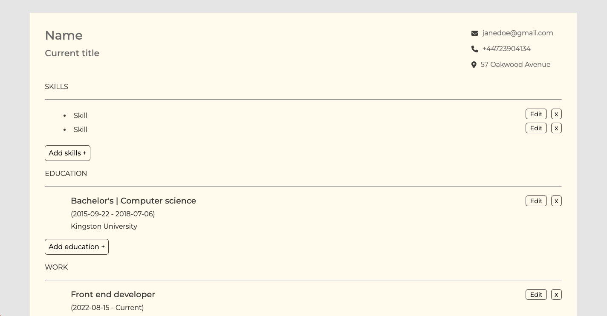

# CV project

## [Live Demo](https://incomparable-axolotl-f2880c.netlify.app)

# Technologies Used

- HTML
- CSS
- Javascript
- React

# Project goals

The main goal of this project was to go deeper into learning about state, props and Hooks. This CV/resume generator lets users fill in their information, edit or delete sections and then download the finished CV as a PDF!
